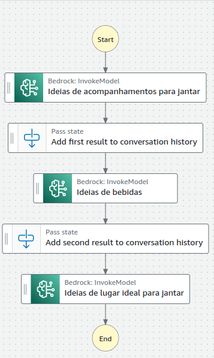
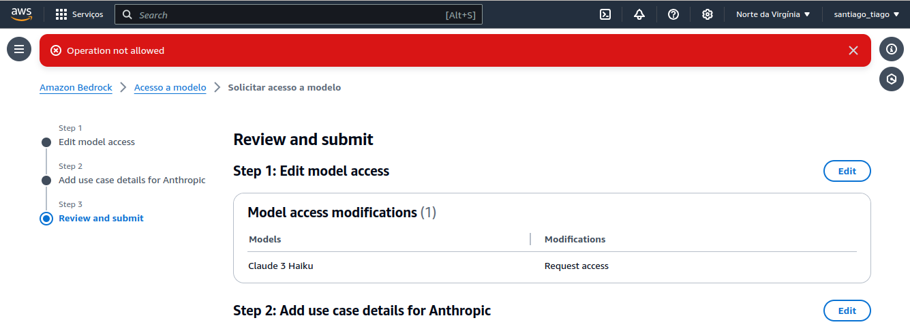

<h1>
    <a href="https://www.dio.me/">
     </a>
    <span> Nexa - Engenharia de Prompts na AWS com Claude
</span>
</h1>

# :computer: Desafio de projeto: Criando um Assistente de Delivery com AWS Step Functions e Bedrock

## Objetivo do desafio:

Utilizar o amazon StepFunctions com o exemplo de modelos do Bedrock para criar um assistente para planejar um jantar romântico.

# :bulb: Solução do desafio 

Segue o design do modelo seguindo o exemplo da Amazon:

<p>

</p>

O código, feito seguindo a prática do instrutor se encontra no arquivo **stepFunction.json**

Mesmo após criar a política para ter acesso aos modelos do Bedrock, usando o product ID do Haiku e do Command-Light:

```json
{
    "Version": "2012-10-17",
    "Statement": [
        {
            "Effect": "Allow",
            "Action": [
                "aws-marketplace:Subscribe"
            ],
            "Resource": "*",
            "Condition": {
                "ForAnyValue:StringEquals": {
                    "aws-marketplace:ProductId": [
                        "prod-ozonys2hmmpeu",
                        "216b69fd-07d5-4c7b-866b-936456d68311"
                    ]
                }
            }
        },
        {
            "Effect": "Allow",
            "Action": [
                "aws-marketplace:Unsubscribe",
                "aws-marketplace:ViewSubscriptions"
            ],
            "Resource": "*"
        }
    ]
}
```
Não foi possível ter acesso aos modelos do Amazon Bedrock, talvez por limitações na conta que estava inativa há algum tempo. Com isso não foi possível executar o modelo.

<p>

</p>