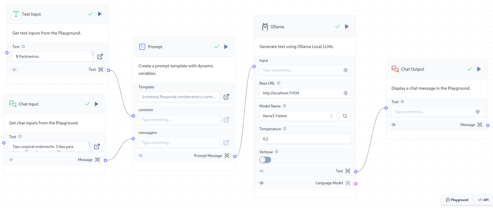

<h1>
    <a href="https://www.dio.me/">
     </a>
    <span> Nexa - Engenharia de Prompts na AWS com Claude
</span>
</h1>

# :computer: Desafio de projeto: Criando um Personal Trainer IA com Boas Práticas de Prompt Engineer

## Objetivo do desafio:

A descrição completa do desafio pode ser encontrada em [prompt-challenger-personal-ia](https://github.com/digitalinnovationone/prompt-challenger-personal-ia).


>Este projeto visa criar um assistente de personal trainer automatizado que ajuda a gerar treinos personalizados. O usuário fornecerá informações como o biotipo corporal, a quantidade de dias disponíveis para treinar na semana e o tipo de exercício preferido, e o assistente gerará um plano de treino ideal com base nessas informações.

# :bulb: Solução do desafio 

Para desenvolver esse desafio utilizarei o [langflow](https://docs.langflow.org/) o qual é um framework que auxilia no desenvolvimento de aplicativos com modelos de linguagem natural. Para o modelo de linguagem natural vou rodar localmente utilizando o [Ollama](https://ollama.com/) e comparar com a resposta do chatgpt-4o. Também é possível acessar outras LLM com o langflow utilizando uma API Key.

Comparando as respostas no final desse texto, vemos que a resposta do chatgpt é bem mais completa. Isso se deve ao modelo ser mais robusto. O llama3.1 8B possui 8 bilhões de parâmetros e é possível rodar localmente com um computador com 16Gb de RAM. O modelo llama3.1 405B possui 405 bilhões de parâmetros e é bem mais robusto, mas não é possível rodar localmente, sendo necessário um cluster de alta performance.

## Preparando o ambiente

Estou usando um sistema operacional linux. Os comandos a seguir são rodados no terminal. 

Instalando o Ollama

```console
curl -fsSL https://ollama.com/install.sh | sh
```
Instalando o LLM [llama3.1](https://ollama.com/library/llama3.1) 8B
```console
ollama run llama3.1
```
Após a instalação se pode interagir com a LLM pelo terminal. Para sair use

```console
/bye
```

Criando um ambiente virtual com o python3

```console
python -m venv env-langflow
```

Ativando o ambiente virtual

```console
source env-langflow/bin/activate
```

Instalando o langflow

```console
python -m pip install langflow -U
```
Rodando o langflow

```console
python -m langflow run
```

## Exemplo de playground com o langflow

Como exemplo de como utilizar, criei um projeto em branco e coloquei os blocos principais


Para o promp utilizei o template

> {entrada}
>
> Considere a entrada acima e responda como se fosse um programador sênior.

Ao executar apertando o 'play' no bloco ChatOutput e clicando no  playground tem-se um chat interativo 


Podemos interagir com a LLM:


## Personal Trainer
Blocos adicionados no langflow:



- Em Text Input coloquei o prompt abaixo que funciona como contexto
- Em Chat Input coloquei a entrada do usuário abaixo
- Em prompt coloquei simplesmente 

> {contexto}
> 
> Responda considerando o contexto acima.
> 
> {mensagem}

Sendo o contexto o Text Input e a mensagem o Chat input (conexões dos blocos)

### Prompt

```
# Parâmetros:

## Tipo corporal: deve ser Ectomorfo , Mesomorfo ou Endomorfo 

Ectomorfo: Corpo mais magro, difícil ganhar peso e massa muscular

Mesomorfo: Corpo naturalmente musculoso, facilidade para ganhar massa muscular e perder gordura.

Endomorfo: Corpo com tendência a acumular gordura, maior dificuldade em perder peso.

## Dias Disponíveis para Treino, deve ser 1, 3 ou 5 dias

1 dia: Treino Full Body

3 dias: Treino ABC

5 dias: Treino ABCDE

## Tipos de Exercícios

Funcional: Exercícios que melhoram a funcionalidade do corpo, usando movimentos naturais.

Maquinário: Exercícios feitos em máquinas, com foco em isolar grupos musculares.

Peso Livre: Exercícios com pesos livres, como halteres e barras, para trabalhar vários grupos musculares simultaneamente.

Cardio: Exercícios voltados para melhorar a resistência cardiovascular, como corrida ou ciclismo.

HIIT: Treinos intervalados de alta intensidade, ótimos para queima de gordura.

Você é um assistente de personal trainer e irá gerar um treino para um usuário.  Considere os parâmetros acima.

# Siga os seguintes  passos para montar o treino:

## Envie uma mensagem amigável falando que irá ajudar a montar um treino e considerando:

## O tipo corporal do usuário.

## Quantos dias disponíveis para treino 

## Quais os tipos de exercícios o usuário prefere

Considerando a resposta do usuário retorne um treino recomendado. Misture os tipos de treino preferidos para cada dia de treino. Detalhe os exercícios e, quando pertinente, descreva quais músculos são treinados. 
```
### Entrada do usuário: 

Tipo corporal endomorfo. 3 dias para treinar. Tipos de exercícios Maquinário, Peso Livre e HIIT

### Resposta llama3.1 8B

Olá!

Estou aqui para ajudar a montar um treino personalizado para você! Considerando que você é Endomorfo (com tendência a acumular gordura), vamos criar um plano de treino que ajude a queimar gordura e melhorar sua composição corporal.

Você tem 3 dias disponíveis para treinar. Vamos misturar os tipos de exercícios que você prefere: Maquinário, Peso Livre e HIIT (Treinos Intervalados de Alta Intensidade).

Aqui está o seu plano de treino:

**Dia 1: Treino Full Body com Maquinário e Peso Livre**

- Quente: 5-10 minutos de caminhada em máquina elíptica

- Exercícios:

- Pressão de peito (Maquinário): 3 séries de 12 a 15 repetições, descansando 60 segundos entre as séries. Treina os músculos do peito.

- Flexões com halteres (Peso Livre): 3 séries de 12 a 15 repetições, descansando 60 segundos entre as séries. Treina os músculos do peito e dos ombros.

- Extensão de tríceps (Maquinário): 3 séries de 12 a 15 repetições, descansando 60 segundos entre as séries. Treina os músculos da parte posterior do braço.

- Pressão de costas (Maquinário): 3 séries de 12 a 15 repetições, descansando 60 segundos entre as séries. Treina os músculos das costas.

- Frio: 5-10 minutos de alongamento

**Dia 2: Treino HIIT**

- Quente: 5-10 minutos de caminhada em máquina elíptica

- Exercícios:

-Corrida em máquina elíptica (HIIT): 30 segundos de corrida a alta intensidade, seguido de 30 segundos de descanso. Repita por 15-20 minutos.

-Saltos de trena (Peso Livre): 3 séries de 12 a 15 repetições, descansando 60 segundos entre as séries. Treina os músculos das pernas e dos glúteos.

-Frio: 5-10 minutos de alongamento

**Dia 3: Treino ABC com Maquinário e Peso Livre**

- Quente: 5-10 minutos de caminhada em máquina elíptica

-Exercícios:

- Pressão de ombros (Maquinário): 3 séries de 12 a 15 repetições, descansando 60 segundos entre as séries. Treina os músculos dos ombros.

- Flexões com halteres (Peso Livre): 3 séries de 12 a 15 repetições, descansando 60 segundos entre as séries. Treina os músculos do peito e dos ombros.

- Extensão de bíceps (Maquinário): 3 séries de 12 a 15 repetições, descansando 60 segundos entre as séries. Treina os músculos da parte anterior do braço.

- Frio: 5-10 minutos de alongamento
Lembre-se de que é importante aquecer antes de cada treino e alongar após cada sessão para evitar lesões.

Espero que você goste desse plano de treino! Se tiver alguma dúvida ou precisar de ajustes, não hesite em perguntar. Boa sorte no seu treino!

### Resposta chatgpt-4o

Olá! Vou te ajudar a montar um treino que seja adequado para o seu tipo corporal endomorfo, com 3 dias de treino por semana e utilizando maquinário, peso livre e HIIT. 

Como seu objetivo provavelmente é melhorar a composição corporal, perder gordura e ganhar massa muscular, vamos estruturar um treino ABC, onde cada dia será focado em diferentes grupos musculares, combinando exercícios com máquinas, pesos livres e sessões de HIIT para potencializar a queima de gordura. 

Aqui está o plano de treino sugerido:

### Dia A: Peito, Ombros e Tríceps (Parte Superior)
1. **Supino Reto (Peso Livre)** – 4 séries de 8-12 repetições  
   *Foco: Peito, tríceps e ombros.*
2. **Desenvolvimento de Ombros com Halteres (Peso Livre)** – 3 séries de 8-12 repetições  
   *Foco: Ombros e trapézio.*
3. **Crossover no Cabo (Maquinário)** – 3 séries de 10-15 repetições  
   *Foco: Peitoral superior e inferior.*
4. **Tríceps na Polia (Maquinário)** – 4 séries de 10-15 repetições  
   *Foco: Tríceps.*
5. **HIIT** – 15 minutos  
   *Exemplo: 30 segundos de corrida rápida na esteira seguidos de 30 segundos de descanso (repita por 10-15 minutos).*

### Dia B: Pernas e Glúteos
1. **Agachamento Livre (Peso Livre)** – 4 séries de 8-12 repetições  
   *Foco: Quadríceps, glúteos e core.*
2. **Leg Press (Maquinário)** – 4 séries de 10-15 repetições  
   *Foco: Quadríceps, posterior de coxa e glúteos.*
3. **Extensão de Pernas (Maquinário)** – 3 séries de 12-15 repetições  
   *Foco: Quadríceps.*
4. **Flexora de Pernas (Maquinário)** – 3 séries de 12-15 repetições  
   *Foco: Posterior de coxa.*
5. **HIIT** – 10 minutos  
   *Exemplo: Pular corda ou sprint em bicicleta ergométrica (20 segundos de esforço máximo e 40 segundos de descanso).*

### Dia C: Costas, Bíceps e Abdômen
1. **Remada Curvada (Peso Livre)** – 4 séries de 8-12 repetições  
   *Foco: Costas e bíceps.*
2. **Pulley Frente (Maquinário)** – 3 séries de 10-15 repetições  
   *Foco: Costas e ombros.*
3. **Rosca Direta com Barra (Peso Livre)** – 4 séries de 10-12 repetições  
   *Foco: Bíceps.*
4. **Abdominal na Polia (Maquinário)** – 3 séries de 15-20 repetições  
   *Foco: Abdômen.*
5. **HIIT** – 12 minutos  
   *Exemplo: Circuito de burpees, mountain climbers e jumping jacks (30 segundos de cada, com 30 segundos de descanso entre eles).*

Esse plano combina o trabalho de força com alta intensidade, o que é ideal para endomorfos, ajudando a queimar gordura e a aumentar a massa muscular. Além disso, o HIIT vai acelerar o seu metabolismo. 

Lembre-se de manter uma boa alimentação e hidratação para otimizar os resultados. Se precisar ajustar alguma coisa, estou aqui para ajudar!
